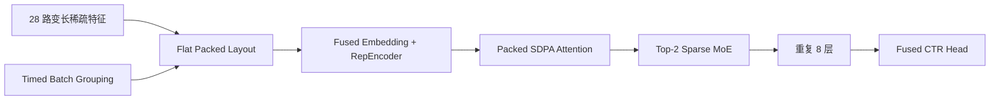

# 百度 2026 CTI 生成式广告排序推理优化

这是一个面向学习与复现的推理优化项目。仓库只保留官方原版 baseline、最终线上最优实现、有效优化路径、关键消融结论和必要工具，不保存逐次实验流水或重复历史版本。

模型主干是稀疏广告特征编码 + RepEncoder + 8 层 Transformer + Top-2 Sparse MoE + CTR Head。项目展示如何在不减少输入样本和 Transformer 层数的前提下，从数据布局、GPU 搬运、算子融合和动态批调度四个层面降低端到端时延。

## 最终结果

| 版本 | 总分 | 时延 | AUC | PCOC |
|---|---:|---:|---:|---:|
| 官方原版 baseline | - | 约 230s | - | - |
| **D150c / `online_best`** | **76.7913** | **9.63042s** | **0.75548** | **0.96852** |

按记录计算，端到端时延降低约 **95.81%**，约为 **23.88 倍加速**。22.72s 是初赛阶段已经优化过的版本，后来被用作决赛参考基线，不是本仓库 `baseline/` 中官方原版代码的时延。

## 十分钟阅读路线

1. [赛题与模型](docs/competition.md)：任务、评分、模型结构和计时边界。
2. [优化原理](docs/optimization-guide.md)：从 baseline 到 online_best 的六条有效主线。
3. [成绩与消融](docs/results.md)：只保留能支持工程结论的线上数据。
4. [复现指南](docs/reproduction.md)：环境、目录、运行、profile 和打包。
5. [合规边界](docs/rules.md)：哪些优化可迁移，哪些做法具有比赛规则风险。

## 模型与优化位置



| 优化层次 | baseline | online_best |
|---|---|---|
| 稀疏输入 | 28 组独立 `(values, offsets)` | 连续 flat values/offsets 布局 |
| H2D | 递归搬运整个 batch | 白名单搬运模型必需 tensor |
| Embedding | Python 循环 + 28 次 pooling | 单个 Triton fused embedding kernel |
| Attention | 手写 mask/softmax/matmul | packed PyTorch SDPA + buffer 复用 |
| MoE | Python expert loop + dense 中间结果 | packed routing + Triton sparse kernels |
| 调度 | 固定 DataLoader batch | 计时区内、受资源预算约束的 lazy grouping |

## 目录

```text
.
├── baseline/                 # 官方原版提交三件套
├── online_best/              # 最终确认线上最优提交三件套
├── docs/
│   ├── competition.md        # 赛题、模型和评分
│   ├── optimization-guide.md # 核心学习文档
│   ├── results.md            # 关键成绩与消融
│   ├── reproduction.md       # 复现与打包
│   ├── rules.md              # 合规与风险
│   └── REFERENCES.md         # 参考资料
├── tools/
│   ├── profile_cached_batches.py
│   ├── package.ps1
│   └── package.sh
└── NOTICE.md
```

## 快速比较

```bash
git diff --no-index baseline/infer.py online_best/infer.py
```

打包最终版本：

```powershell
.\tools\package.ps1 online_best
```

仓库不包含比赛数据、模型权重、cached batches、未公开标签、SSH 凭据、浏览器登录态和提交 ZIP。完整运行需要自行获得合法的数据与 checkpoint。
